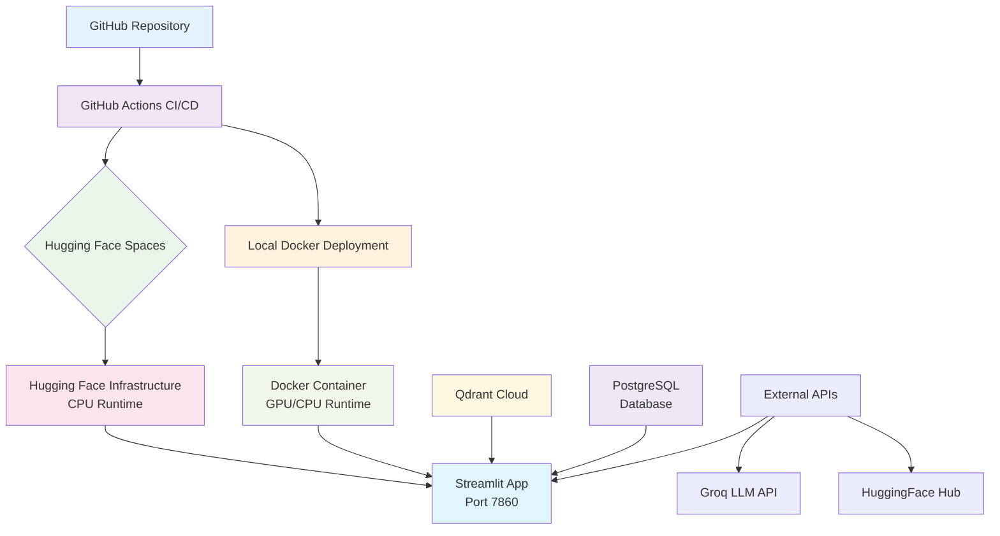
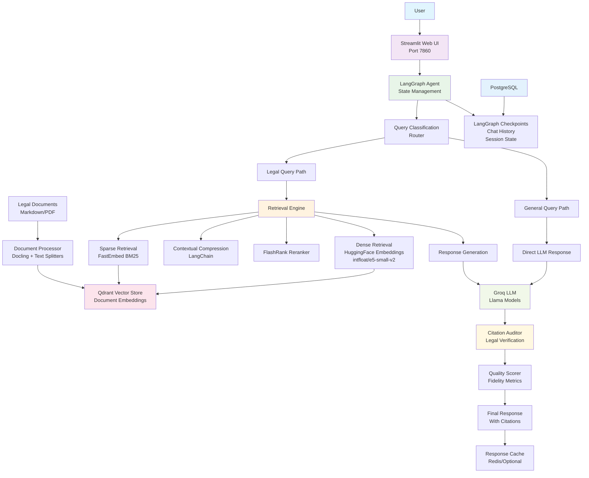

# NyayaAI: Intelligent Legal Consultation for Modern India ⚖️

An AI-powered legal consultation platform that leverages Retrieval-Augmented Generation (RAG) to provide intelligent answers about Indian law. Features a comprehensive knowledge base of 17+ legal acts and uses advanced AI technologies for accurate, context-aware legal research and guidance.

## 🌟 Features

- **Intelligent Legal Query Processing**: Natural language queries about Indian law with context-aware responses
- **Comprehensive Legal Knowledge Base**: Includes 17 major Indian legal documents covering criminal, civil, constitutional, and commercial law:

| Legal Document | Year | Description |
|----------------|------|-------------|
| **Bharatiya Nagarik Suraksha Sanhita (BNSS)** | 2023 | Criminal Procedure Code - Replaces CrPC 1973, governs criminal investigations and trials |
| **Bharatiya Nyaya Sanhita (BNS)** | 2023 | Penal Code - Replaces IPC 1860, defines criminal offenses and punishments |
| **Bharatiya Sakshya Adhiniyam (BSA)** | 2023 | Evidence Act - Replaces Indian Evidence Act 1872, governs admissibility of evidence |
| **Constitution of India (Fundamental Rights)** | 1950 | Fundamental rights and duties of Indian citizens |
| **Code of Civil Procedure (CPC)** | 1908 | Governs civil litigation procedures and court processes |
| **Indian Contract Act** | 1872 | Regulates formation and enforcement of contracts |
| **Transfer of Property Act** | 1882 | Governs transfer of immovable property rights |
| **Indian Succession Act** | 1925 | Regulates inheritance and succession of property |
| **Hindu Marriage Act** | 1955 | Governs Hindu marriage ceremonies and divorce procedures |
| **Special Marriage Act** | 1954 | Enables inter-religious and civil marriages |
| **Negotiable Instruments Act** | 1881 | Regulates promissory notes, bills of exchange, and cheques |
| **Information Technology Act** | 2000 | Governs cyber crimes, electronic commerce, and data protection |
| **Consumer Protection Act** | 2019 | Protects consumer rights and regulates unfair trade practices |
| **Code on Wages** | 2019 | Regulates minimum wages, bonus, and working conditions |
| **POCSO Act** | 2012 | Protection of Children from Sexual Offences |
| **Narcotic Drugs and Psychotropic Substances Act** | 1985 | Controls manufacture, possession, and trafficking of narcotics |
| **Registration Act** | 1908 | Mandates registration of documents affecting immovable property |
- **Citation Verification**: Automated auditing system to ensure responses are grounded in legal texts
- **Quality Scoring**: Built-in evaluation system for response accuracy and reliability
- **Modern Web Interface**: Clean, professional Streamlit-based chat interface
- **GPU Acceleration**: Optimized for NVIDIA GPU usage with CUDA support
- **Persistent Conversations**: PostgreSQL-backed chat history and state management
- **Free-Tier Keep‑Alive Service**: Automatically pings the app and Qdrant Cloud to prevent Hugging Face Spaces from sleeping (includes `?health=true` endpoint)

## 🏗️ Architecture

The system follows a modular RAG architecture with support for multiple deployment targets. Below are the deployment and runtime architectures:

### Deployment Architecture



### Runtime Architecture



### Component Details

#### **Frontend Layer**
- **Streamlit Web UI**: Responsive chat interface with real-time streaming
- **Auto-scroll**: Automatic scrolling for conversation continuity
- **Professional Styling**: Custom CSS with Inter font and dark theme

#### **Agent Layer**
- **LangGraph Agent**: Graph-based conversation orchestration
- **State Management**: TypedDict-based state with messages, context, and evaluation
- **Query Routing**: Intelligent classification between legal and general queries

#### **Retrieval Layer**
- **Multi-Modal Retrieval**: Combines dense (semantic) and sparse (keyword) search
- **Qdrant Vector Store**: High-performance vector database with hybrid search
- **HuggingFace Embeddings**: `intfloat/e5-small-v2` for semantic understanding
- **FastEmbed BM25**: Sparse retrieval for exact keyword matching
- **FlashRank Reranker**: Result re-ranking for improved relevance
- **Contextual Compression**: Dynamic context pruning for optimal token usage

#### **Generation Layer**
- **Groq LLM**: Fast inference with Llama 3 models via Groq API
- **Citation Auditor**: Automated verification against legal sources
- **Quality Scoring**: Multi-dimensional evaluation (high/medium/low fidelity)
- **Fallback Handling**: Graceful degradation for edge cases

#### **Data Processing Layer**
- **Document Processor**: Docling-based PDF/document conversion
- **Text Splitters**: Hierarchical splitting (headers + recursive)
- **Legal Knowledge Base**: Curated collection of Indian legal documents
- **Incremental Updates**: Support for adding new legal documents

#### **Persistence Layer**
- **PostgreSQL**: ACID-compliant storage for chat history and checkpoints
- **LangGraph Checkpoints**: Conversation state persistence across sessions
- **Model Caching**: HuggingFace and FastEmbed model persistence
- **Log Management**: Structured logging with rotation

#### **Deployment Layer**
- **Docker Containerization**: Multi-stage builds with UV package manager
- **Hugging Face Spaces**: One-click cloud deployment with CPU optimization
- **GitHub Actions CI/CD**: Automated deployment pipeline with Git LFS support
- **Environment Flexibility**: Local GPU vs Cloud CPU configurations
- **Volume Management**: Persistent storage for models, logs, and documents

### Data Flow

1. **Document Ingestion**: Legal documents → Docling processing → Text splitting → Embedding generation → Qdrant indexing
2. **Query Processing**: User query → Classification → Retrieval (dense + sparse) → Reranking → Context compression
3. **Response Generation**: Retrieved context + query → Groq LLM → Citation audit → Quality scoring → Final response
4. **State Management**: Conversation history → PostgreSQL checkpoints → Session persistence

### Security & Performance

- **API Key Management**: Secure environment variable handling
- **Model Caching**: Optimized loading with LRU caching
- **Resource Optimization**: GPU acceleration for local, CPU optimization for cloud
- **Error Handling**: Comprehensive exception handling with fallbacks
- **Audit Trail**: Complete logging of all operations and decisions

## 🚀 Deployment

The system supports multiple deployment targets with automated CI/CD pipelines.

### Deployment Options

#### 1. Hugging Face Spaces (Recommended for Cloud)

**Automated Deployment via GitHub Actions:**

The system includes a GitHub Actions workflow (`.github/workflows/deploy.yml`) that automatically deploys to Hugging Face Spaces on every push to the master branch.

**Setup Steps:**

1. **Create Hugging Face Space**:
   - Go to [Hugging Face Spaces](https://huggingface.co/spaces)
   - Create a new Space with Docker SDK
   - Set Python version to 3.12

2. **Configure Secrets in GitHub**:
   ```bash
   # In your GitHub repository settings > Secrets and variables > Actions
   HF_TOKEN=your_huggingface_token
   HF_USERNAME=your_huggingface_username
   SPACE_NAME=your_space_name
   ```

3. **Push to Master Branch**:
   ```bash
   git add .
   git commit -m "Deploy to Hugging Face Spaces"
   git push origin master
   ```

**Hugging Face Deployment Features:**
- **Automatic Scaling**: Serverless infrastructure with auto-scaling
- **Git LFS Support**: Handles large model files and legal documents
- **CPU Optimization**: Automatically uses CPU-only PyTorch for cost efficiency
- **Persistent Storage**: Model cache and logs persist across deployments
- **Zero Configuration**: Works out-of-the-box with provided Dockerfile

#### 2. Local Docker Deployment

**Prerequisites:**
- Docker and Docker Compose
- NVIDIA GPU (optional, for accelerated inference)
- API Keys:
  - `GROQ_API_KEY`: For LLM inference
  - `QDRANT_URL`: Qdrant vector database URL
  - `QDRANT_API_KEY`: Qdrant API key
  - `HF_TOKEN`: HuggingFace token (optional, for model downloads)

**Environment Setup:**

1. **Clone the repository**:
   ```bash
   git clone <repository-url>
   cd Legal_Advisor_System
   ```

2. **Create environment file**:
   ```bash
   cp .env.example .env
   # Edit .env with your API keys
   ```

3. **Build and run with Docker Compose**:
   ```bash
   docker-compose up --build
   ```

### Deployment Configuration

#### Docker Build Arguments
- `TARGET_ENV=local`: Uses GPU-enabled PyTorch (cu126) for local development
- `TARGET_ENV=cloud`: Uses CPU-only PyTorch for cloud deployment (Hugging Face)

#### Port Configuration
- **Local**: Host port `8501` → Container port `7860`
- **Hugging Face**: Automatic port assignment (typically 7860)

#### Persistent Volumes (Local Deployment)
- `model_cache`: HuggingFace and FastEmbed model cache
- `docs`: Additional legal documents
- `logs`: Application logs
- `scratch`: Processed document chunks

#### Environment Variables
- `DEVICE_TYPE`: `cuda` for GPU, `cpu` for CPU-only
- `WATCHFILES_FORCE_POLLING`: `true` for development hot-reload
- `PGCHANNELBINDING`: `disable` for PostgreSQL compatibility
- `UV_SYSTEM_PYTHON`: `1` for UV package manager

### Production Deployment

For production environments:

1. **External Databases**:
   - Configure external PostgreSQL instance
   - Use Qdrant Cloud for vector storage
   - Set up Redis for response caching (optional)

2. **Security**:
   - Use reverse proxy (nginx) for SSL termination
   - Implement API rate limiting
   - Enable audit logging

3. **Monitoring**:
   - Set up application monitoring
   - Configure log aggregation
   - Enable performance metrics

4. **Scaling**:
   - Enable resource limits in docker-compose.yml
   - Configure horizontal scaling for high traffic
   - Implement load balancing

### Local Development

For development with hot-reload:

```yaml
# docker-compose.yml excerpt
volumes:
  - ..:/app  # Mount source code
environment:
  - WATCHFILES_FORCE_POLLING=true
  - DEVICE_TYPE=cuda  # For GPU development
```

### CI/CD Pipeline

The GitHub Actions workflow provides:

- **Automated Testing**: Runs on every push
- **Git LFS Integration**: Handles large files (models, documents)
- **Force Sync**: Ensures clean deployments to Hugging Face
- **Environment-Specific Builds**: Different configurations for local vs cloud

## 📋 Usage

1. **Start the application**:
   ```bash
   docker-compose up
   ```

2. **Access the web interface**:
   Open `http://localhost:8501` in your browser

3. **Query the system**:
   - Ask questions in natural language about Indian law
   - Examples:
     - "What are the penalties for cybercrime under IT Act?"
     - "Explain the fundamental rights under the Constitution"
     - "How does the BNS differ from IPC in handling criminal cases?"

4. **Review responses**:
   - Each response includes citations from legal texts
   - Quality scores indicate response reliability
   - Chat history is preserved across sessions

## 🔧 Configuration

Key configuration files:

- `src/config.py`: Model settings, API keys, directories
- `docker-compose.yml`: Deployment configuration
- `pyproject.toml`: Python dependencies and project metadata
- `.env`: Environment variables (API keys, database URLs)

## 🤝 Contributing

1. Fork the repository
2. Create a feature branch
3. Make your changes
4. Add tests if applicable
5. Submit a pull request

## 📄 License

See LICENSE file for details.

## ⚠️ Disclaimer

This system provides general legal information based on available legal texts. It is not a substitute for professional legal advice. Always consult qualified legal professionals for specific legal matters.
