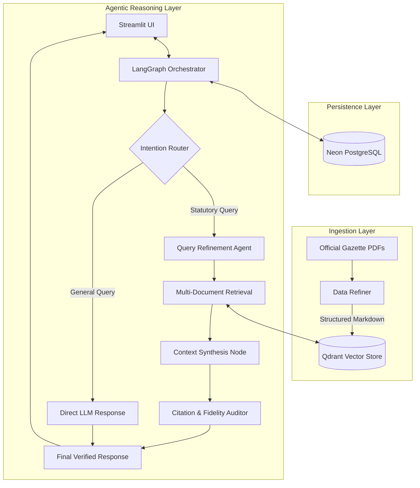

# LegisYukti ⚖️
### *An Agentic RAG Framework for Multi-Document Reasoning*
[](https://huggingface.co/spaces/tusharmishra288/legisyukti-rag-engine)

An experimental AI-powered legal reasoning platform that leverages **Agentic Retrieval-Augmented Generation (RAG)** to provide grounded insights into Indian law. **LegisYukti** focuses on structural text extraction and verified reasoning across a comprehensive knowledge base of 17+ primary statutes.

---

### 📖 The Meaning Behind the Name
The name **LegisYukti** is a hybrid of two linguistic roots, representing the bridge between ancient logic and modern legislation:

* **Legis (Latin):** The universal root for **"Law"** or **"Legislation,"** representing the formal statutory framework.
* **Yukti (Sanskrit: युक्ति):** A term from Indian logic meaning **"Reasoning," "Skillful Application,"** or **"Logic."** It represents the active process of using intelligence to find a solution or an inference.

Together, **LegisYukti** signifies the **intelligent application of logic to the law**—moving beyond simple keyword search toward structured statutory reasoning.

---

## 🚀 Project Overview
**LegisYukti** is an experimental framework designed to navigate the complexities of the Indian legal landscape, specifically focusing on the transition to the **2023 legal reforms (BNS, BNSS, BSA)**. 

Unlike standard chatbots that may hallucinate, LegisYukti utilizes an **Agentic RAG** architecture. It treats legal documents not just as raw text, but as a structured knowledge base, ensuring every consultation is grounded in verified, official statutes.

#### **Key Technical Pillars:**
- **Agentic Orchestration**: Built with **LangGraph**, the system utilizes a multi-node state machine to manage conversation flow, refine search queries, and validate findings.
- **High-Fidelity Retrieval**: Powered by **Qdrant**, the framework performs semantic searches across 17 primary statutes, ensuring precision even in complex, cross-document queries.
- **Data Refiner**: A custom preprocessing pipeline that transforms noisy, multi-lingual Gazette PDFs into structured Markdown, preserving alphanumeric section hierarchies (e.g., 53A, 106B).
- **Faithful Grounding**: Every response includes direct section-level citations and a "Fidelity Score" to maintain transparency and minimize AI hallucinations.

## 🌟 Features

- **Intelligent Legal Query Processing**: - Multi-step reasoning for complex legal questions with context-aware responses.
- **Citation Verification**: Automated auditing system to ensure responses are grounded in legal texts
- **Quality Scoring**: Built-in evaluation system for response accuracy and reliability
- **Modern Web Interface**: Clean, professional Streamlit-based chat interface
- **GPU Acceleration**: Optimized for NVIDIA GPU usage with CUDA support
- **Persistent Conversations**: Neon (PostgreSQL-compatible) backed chat history and state management
- **Free-Tier Keep‑Alive Service**: Automatically pings the app and Qdrant Cloud to prevent it from sleeping
- **Comprehensive Legal Knowledge Base**: Includes 17 major Indian legal documents covering criminal, civil, constitutional, and commercial law:

| Legal Document | Year | Description |
|----------------|------|-------------|
| **Bharatiya Nagarik Suraksha Sanhita (BNSS)** | 2023 | Criminal Procedure Code - Replaces CrPC 1973, governs criminal investigations and trials |
| **Bharatiya Nyaya Sanhita (BNS)** | 2023 | Penal Code - Replaces IPC 1860, defines criminal offenses and punishments |
| **Bharatiya Sakshya Adhiniyam (BSA)** | 2023 | Evidence Act - Replaces Indian Evidence Act 1872, governs admissibility of evidence |
| **Constitution of India (Fundamental Rights)** | 1950 | Fundamental rights and duties of Indian citizens |
| **Code of Civil Procedure (CPC)** | 1908 | Governs civil litigation procedures and court processes |
| **Indian Contract Act** | 1872 | Regulates formation and enforcement of contracts |
| **Transfer of Property Act** | 1882 | Governs transfer of immovable property rights |
| **Indian Succession Act** | 1925 | Regulates inheritance and succession of property |
| **Hindu Marriage Act** | 1955 | Governs Hindu marriage ceremonies and divorce procedures |
| **Special Marriage Act** | 1954 | Enables inter-religious and civil marriages |
| **Negotiable Instruments Act** | 1881 | Regulates promissory notes, bills of exchange, and cheques |
| **Information Technology Act** | 2000 | Governs cyber crimes, electronic commerce, and data protection |
| **Consumer Protection Act** | 2019 | Protects consumer rights and regulates unfair trade practices |
| **Code on Wages** | 2019 | Regulates minimum wages, bonus, and working conditions |
| **POCSO Act** | 2012 | Protection of Children from Sexual Offences |
| **Narcotic Drugs and Psychotropic Substances Act** | 1985 | Controls manufacture, possession, and trafficking of narcotics |
| **Registration Act** | 1908 | Mandates registration of documents affecting immovable property |

## 🏗️ Architecture

The system follows a modular RAG architecture. The runtime behavior is the same whether deployed locally (Docker) or in the cloud (Hugging Face Spaces), with only the deployment path differing.

### Architecture Diagram


> **Note:** The runtime logic (retrieval, LLM, citation auditing) stays the same regardless of deployment. Local Docker deployment is detailed in the deployment section below.

### Key Components

#### **Frontend**
- **Streamlit Web UI**: Clean chat interface for legal queries
- **Real-time Streaming**: Live response generation with typing effects
- **Professional Design**: Dark theme with legal-themed styling

#### **AI Engine**
- **LangGraph Agent**: Orchestrates the legal research workflow
- **Query Classification**: Routes legal vs general questions
- **Citation Verification**: Ensures responses are grounded in legal texts

#### **Retrieval System**
- **Qdrant Vector Database**: Stores legal document embeddings
- **Hybrid Search**: Combines semantic and keyword-based retrieval
- **Legal Knowledge Base**: 17+ Indian legal documents indexed

#### **LLM Integration**
- **Groq API**: Fast inference with Llama models
- **Quality Scoring**: Rates response accuracy and reliability
- **Context Management**: Optimizes token usage for legal reasoning

#### **Data Storage**
- **Neon (PostgreSQL compatible)**: Conversation history and session persistence
- **Model Caching**: FastEmbed and HuggingFace model storage
- **Document Processing**: PDF to markdown conversion pipeline

### How It Works

1. **User asks a legal question** → Streamlit UI captures input
2. **Query gets classified** → Legal questions go to retrieval, general questions get direct answers
3. **Legal documents searched** → Qdrant finds relevant sections using vector similarity
4. **Context assembled** → Most relevant legal text combined with user question
5. **LLM generates response** → Groq API creates accurate, cited legal guidance
6. **Quality verified** → Response checked against source documents
7. **Answer delivered** → Formatted response with citations and confidence score

### Security & Performance

- **API Key Management**: Secure environment variable handling
- **Model Caching**: Optimized loading with LRU caching
- **Resource Optimization**: GPU acceleration for local, CPU optimization for cloud
- **Error Handling**: Comprehensive exception handling with fallbacks
- **Audit Trail**: Complete logging of all operations and decisions

## 🚀 Deployment

The system supports multiple deployment targets with automated CI/CD pipelines.

### Deployment Options

#### 1. Hugging Face Spaces (Recommended for Cloud)

**Automated Deployment via GitHub Actions:**

The system includes a GitHub Actions workflow (`.github/workflows/deploy.yml`) that automatically deploys to Hugging Face Spaces on every push to the master branch.

**Setup Steps:**

1. **Create Hugging Face Space**:
   - Go to [Hugging Face Spaces](https://huggingface.co/spaces)
   - Create a new Space with Docker SDK
   - Set Python version to 3.12

2. **Configure Secrets in GitHub**:
   ```bash
   # In your GitHub repository settings > Secrets and variables > Actions
   HF_TOKEN=your_huggingface_token
   HF_USERNAME=your_huggingface_username
   SPACE_NAME=your_space_name
   ```

3. **Push to Master Branch**:
   ```bash
   git add .
   git commit -m "Deploy to Hugging Face Spaces"
   git push origin master
   ```

**Hugging Face Deployment Features:**
- **Automatic Scaling**: Serverless infrastructure with auto-scaling
- **Git LFS Support**: Handles large model files and legal documents
- **CPU Optimization**: Automatically uses CPU-only PyTorch for cost efficiency
- **Persistent Storage**: Model cache and logs persist across deployments
- **Zero Configuration**: Works out-of-the-box with provided Dockerfile

#### 2. Local Docker Deployment

**Prerequisites:**
- Docker and Docker Compose
- NVIDIA GPU (optional, for accelerated inference)
- API Keys:
  - `GROQ_API_KEY`: For LLM inference
  - `QDRANT_URL`: Qdrant vector database URL
  - `QDRANT_API_KEY`: Qdrant API key
  - `POSTGRES_URI`: Neon cloud database connection string
  - `HF_TOKEN`: HuggingFace token (optional, for model downloads)

**Quick Start Commands:**

```bash
# 1. Clone and setup
git clone <repository-url>
cd LegisYukti
cp .env.example .env
# Edit .env with your API keys

# 2. Build and run (GPU-enabled for local development)
docker-compose up --build

# 3. Access the app
# Open http://localhost:8501 in your browser
```

**Alternative Docker Commands:**

```bash
# Build image manually
docker build -t legisyukti_app --build-arg TARGET_ENV=local .

# Run with GPU support
docker run --rm -p 8501:7860 \
  --gpus all \
  -v $(pwd)/model_cache:/app/model_cache \
  -v $(pwd)/logs:/app/logs \
  --env-file .env \
  legisyukti_app

# Run CPU-only
docker run --rm -p 8501:7860 \
  -v $(pwd)/model_cache:/app/model_cache \
  -v $(pwd)/logs:/app/logs \
  --env-file .env \
  legisyukti_app
```

### Deployment Comparison

| Feature | Hugging Face Spaces | Local Docker |
|---------|-------------------|--------------|
| **Setup Time** | 5 minutes | 15 minutes |
| **Cost** | Free tier available | Local hardware costs |
| **GPU Support** | CPU only | Full GPU support |
| **Persistence** | Automatic | Manual volume mounting |
| **Scaling** | Auto-scaling | Single instance |
| **Internet Access** | Public URL | Local only |
| **Commands** | `git push` | `docker-compose up` |

### Deployment Configuration

#### Docker Build Arguments
- `TARGET_ENV=local`: Uses GPU-enabled PyTorch (cu126) for local development
- `TARGET_ENV=cloud`: Uses CPU-only PyTorch for cloud deployment (Hugging Face)

#### Port Configuration
- **Local**: Host port `8501` → Container port `7860`
- **Hugging Face**: Automatic port assignment (typically 7860)

#### Persistent Volumes (Local Deployment)
- `model_cache`: HuggingFace and FastEmbed model cache
- `docs`: Additional legal documents
- `logs`: Application logs
- `scratch`: Processed document chunks

#### Environment Variables
- `DEVICE_TYPE`: `cuda` for GPU, `cpu` for CPU-only
- `WATCHFILES_FORCE_POLLING`: `true` for development hot-reload
- `PGCHANNELBINDING`: `disable` for Neon (PostgreSQL) compatibility
- `UV_SYSTEM_PYTHON`: `1` for UV package manager

### Deployment Configuration

#### Docker Build Arguments
- `TARGET_ENV=local`: Uses GPU-enabled PyTorch (cu126) for local development
- `TARGET_ENV=cloud`: Uses CPU-only PyTorch for cloud deployment (Hugging Face)

#### Port Configuration
- **Local**: Host port `8501` → Container port `7860`
- **Hugging Face**: Automatic port assignment (typically 7860)

#### Persistent Volumes (Local Deployment)
- `model_cache`: HuggingFace and FastEmbed model cache
- `docs`: Additional legal documents
- `logs`: Application logs
- `scratch`: Processed document chunks

#### Environment Variables
- `DEVICE_TYPE`: `cuda` for GPU, `cpu` for CPU-only
- `WATCHFILES_FORCE_POLLING`: `true` for development hot-reload
- `PGCHANNELBINDING`: `disable` for Neon (PostgreSQL) compatibility
- `UV_SYSTEM_PYTHON`: `1` for UV package manager

### Production Deployment

For production environments:

1. **External Databases**:
   - Configure external Neon database (PostgreSQL-compatible) instance
   - Use Qdrant Cloud for vector storage

2. **Security**:
   - Use reverse proxy (nginx) for SSL termination
   - Implement API rate limiting
   - Enable audit logging

3. **Monitoring**:
   - Set up application monitoring
   - Configure log aggregation
   - Enable performance metrics

4. **Scaling**:
   - Enable resource limits in docker-compose.yml
   - Configure horizontal scaling for high traffic
   - Implement load balancing

### Local Development

For development with hot-reload:

```yaml
# docker-compose.yml excerpt
volumes:
  - ..:/app  # Mount source code
environment:
  - WATCHFILES_FORCE_POLLING=true
  - DEVICE_TYPE=cuda  # For GPU development
```

### CI/CD Pipeline

The GitHub Actions workflow provides:

- **Automated Testing**: Runs on every push
- **Git LFS Integration**: Handles large files (models, documents)
- **Force Sync**: Ensures clean deployments to Hugging Face
- **Environment-Specific Builds**: Different configurations for local vs cloud

## 📋 Usage

1. **Start the application**:
   ```bash
   docker-compose up
   ```

2. **Access the web interface**:
   Open `http://localhost:8501` in your browser

3. **Query the system**:
   - Ask questions in natural language about Indian law
   - Examples:
     - "What are the penalties for cybercrime under IT Act?"
     - "Explain the fundamental rights under the Constitution"
     - "How does the BNS differ from IPC in handling criminal cases?"

4. **Review responses**:
   - Each response includes citations from legal texts
   - Quality scores indicate response reliability
   - Chat history is preserved across sessions

## 🔧 Configuration

Key configuration files:

- `src/config.py`: Model settings, API keys, directories
- `docker-compose.yml`: Deployment configuration
- `pyproject.toml`: Python dependencies and project metadata
- `.env`: Environment variables (API keys, database URLs)

## 🤝 Contributing

1. Fork the repository
2. Create a feature branch
3. Make your changes
4. Add tests if applicable
5. Submit a pull request

## 📄 License

See LICENSE file for details.

## ⚠️ Disclaimer

LegisYukti provides general legal information based on available legal texts. It is not a substitute for professional legal advice. Always consult qualified legal professionals for specific legal matters.
